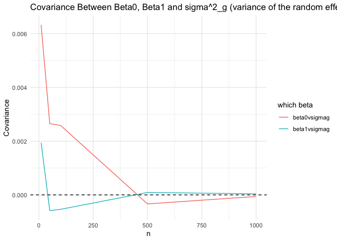
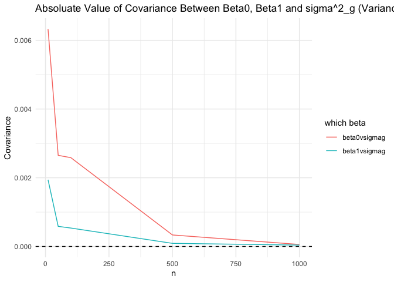

Mixed Effects
================
2024-07-01

First we need a function that produces the intra-individual correlation
design matrix $\mathbf{Z}$:

``` r
# get intra-individual correlation design matrix
# kronecker product produces this

generate_re_block <- function(n, m) {
  
  # create a block of ones of size m x 1
  block <- matrix(1, nrow = m, ncol = 1)
  
  # get z matrix
  z <- kronecker(diag(n), block)
  
  return(z)
}

# test
generate_re_block(3, 2)
```

    ##      [,1] [,2] [,3]
    ## [1,]    1    0    0
    ## [2,]    1    0    0
    ## [3,]    0    1    0
    ## [4,]    0    1    0
    ## [5,]    0    0    1
    ## [6,]    0    0    1

``` r
generate_data <- function(n, m, x,id,  beta0, beta1, sigma_u2, sigma_e2) {
  #individual
  
  # random effects design matrix
  z <- generate_re_block(n, m)
  
  # random effect
  u <- rmvnorm(n, 0, sigma_u2 * diag(1))
  
  # error
  epsilon <- rmvnorm(n*m, 0, sigma_e2 * diag(1))
  
  # calculate y
  y <- beta0 + beta1 * x + z %*% u + epsilon
  
  # return data
  data.frame(y = y, x = x, id = id)
}
n = 3; m= 2
# design matrix
  x <- rmvnorm(n*m, mean = 0, diag(1))
    id <- rep(1:n, each = m)

# test
generate_data(n = 3, m = 2, x = x, id = id, beta0 = 1, beta1 = 2, sigma_u = 1, sigma_e = 1)
```

    ##            y          x id
    ## 1  0.3960286 -0.7255473  1
    ## 2  3.1546680  0.7606089  1
    ## 3  2.5888545  1.5870193  2
    ## 4 -0.3994670  0.1407663  2
    ## 5  7.7065679  1.6119938  3
    ## 6  4.5798436  0.3100606  3

Note that I am fixing the number of observations per individual to
$m = 10$, the number of simulations to $nsims = 200$, and testing number
of individuals $n = 10, 50, 100, 500, 1000$. I can try other $m$,
$nsims$, and $n$, but will need maybe need to run it on a cluster
because this is already taking a while.

``` r
set.seed(1)

sim_data <- data.frame(n = c(10, 50, 100, 500, 1000), 
                       "beta0vsigmag" = NA, 
                       "beta1vsigmag" = NA)

for(n in c(10, 50, 100, 500, 1000)){
  
  nsims = 200
  m = 10
  # design matrix
  x <- rmvnorm(m*n, mean = 0, diag(1))
  id <- rep(1:n, each = m)
  
  beta0 = 1; beta1 = 2; sigma_u2 = 1; sigma_e2 = 1
  
  sims <- replicate(nsims, {
    
  
    data <- generate_data(n = n, m = m, x = x, id = id, beta0 = beta0, beta1 = beta1, sigma_u2 = sigma_u2, sigma_e2 = sigma_e2)
    
    # fit model
    mod <- lmer(y ~ x + (1 | id), data = data, REML = FALSE)
    
    fe <- unname(fixef(mod))
    varcov <- VarCorr(mod)
    
    re_var <- unname(attr(varcov$id, "stddev"))^2
    res_var <- unname(attr(varcov, "sc"))^2
  
    return(c(beta0 = fe[1], beta1 = fe[2], re_var = re_var, res_var = res_var))
  })
  
  # simulated variance covariance
  sim_var <- cov(t(sims))
  
  
  sim_data[sim_data$n == n, ] <- c(n, sim_var[1, 3], sim_var[2, 3])
}
```

The first plot shows simulated $Cov(\beta_0, \sigma_\gamma^2 )$ and
$Cov(\beta_1, \sigma_\gamma^2 )$, and the second plot shows the
absoluate value of these.

``` r
sim_data %>%
  pivot_longer(cols = c(beta0vsigmag, beta1vsigmag), names_to = "cov") %>%
  ggplot(aes(x = n, y = value, group =cov , color = cov))+
  geom_line() +
  theme_minimal()+
  geom_hline(yintercept =  0, linetype = 'dashed') + 
  labs(y = "Covariance", x = "n", color = "which beta", title = "Covariance Between Beta0, Beta1 and sigma^2_g (variance of the random effect)" )
```

<!-- -->

``` r
sim_data %>%
  pivot_longer(cols = c(beta0vsigmag, beta1vsigmag), names_to = "cov") %>%
  ggplot(aes(x = n, y = abs(value), group =cov , color = cov))+
  geom_line() +
  theme_minimal()+
  geom_hline(yintercept =  0, linetype = 'dashed') + 
  labs(y = "Covariance", x = "n", color = "which beta", title = "Absoluate Value of Covariance Between Beta0, Beta1 and sigma^2_g (Variance of the Random Effect)" )
```

<!-- -->
