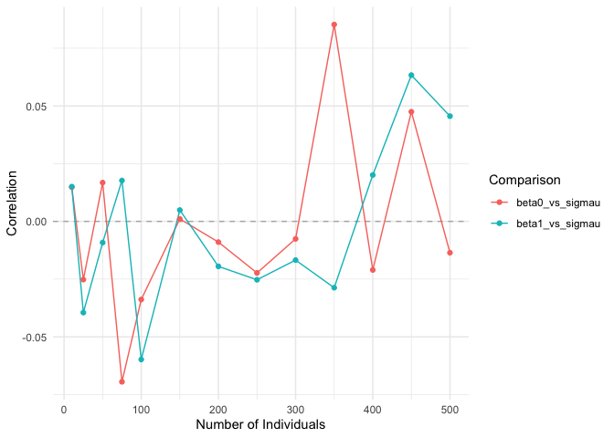
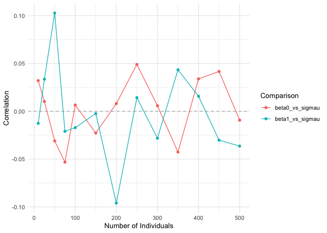
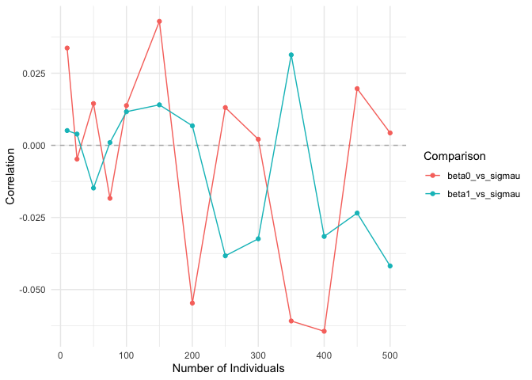
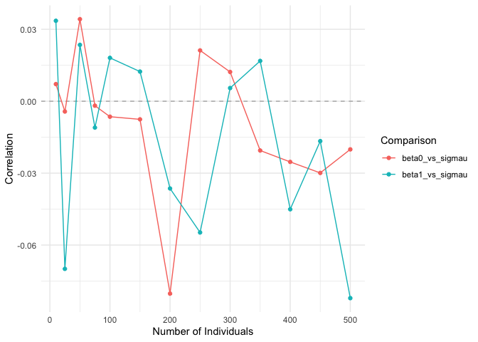

## Model

Mixed effects model with two fixed effects (including an intercept) and
correlation within individual.

*y*<sub>*i**t*</sub> = *β*<sub>0</sub> + *x*<sub>*i**t*</sub>*β*<sub>1</sub> + *γ*<sub>*i*</sub> + *ϵ*<sub>*i**t*</sub>
This is the matrix form with 3 individuals and 2 obserations per
individual.

$$
\begin{bmatrix}
y\_{11} \\
y\_{12} \\
y\_{21} \\
y\_{22} \\
y\_{31} \\
y\_{32}
\end{bmatrix} = 
\beta_0 \begin{bmatrix}
1 \\
1 \\
1 \\
1 \\
1 \\
1
\end{bmatrix} +\beta_1 \begin{bmatrix}
x\_{11} \\
x\_{12} \\
x\_{21} \\
x\_{22} \\
x\_{31} \\
x\_{32}
\end{bmatrix} + 
\begin{bmatrix}
1 & 0 & 0 \\
1 & 0 & 0 \\
0 & 1 & 0 \\
0 & 1 & 0 \\
0 & 0 & 1 \\
0 & 0 & 1
\end{bmatrix}
\begin{bmatrix}
\gamma_1 \\
\gamma_2 \\
\gamma_3
\end{bmatrix} +
\begin{bmatrix}
\epsilon\_{11} \\
\epsilon\_{12} \\
\epsilon\_{21} \\
\epsilon\_{22} \\
\epsilon\_{31} \\
\epsilon\_{32}
\end{bmatrix}
$$

with *γ*<sub>*i*</sub> ∼ *N*(0,*σ*<sub>*γ*</sub><sup>2</sup>) and
*ϵ*<sub>*i*</sub> ∼ *N*(0,*σ*<sub>*ϵ*</sub><sup>2</sup>).

## Data Simulation Functions

First we need a function that produces the intra-individual correlation
design matrix **Z**:

``` r
# get intra-individual correlation design matrix
# kronecker product produces this

generate_random_effects_block_matrix <- function(n, m) {
  
  # create a block of ones of size m x 1
  block <- matrix(1, nrow = m, ncol = 1)
  
  # get z matrix
  z <- kronecker(diag(n), block)
  
  return(z)
}

# test
generate_random_effects_block_matrix(3, 2)
```

    ##      [,1] [,2] [,3]
    ## [1,]    1    0    0
    ## [2,]    1    0    0
    ## [3,]    0    1    0
    ## [4,]    0    1    0
    ## [5,]    0    0    1
    ## [6,]    0    0    1

We will generate data as follows:

$$\mathbf{x} = \begin{bmatrix} x\_{11} \\
x\_{12} \\
... \\
x\_{1m} \\
... \\
x\_{n1} \\
... \\
x\_{nm}\\
\end{bmatrix} \sim MVN(0, I\_{nm})$$

**γ** ∼ *M**V**N*(0,*σ*<sub>*u*</sub><sup>2</sup>*I*<sub>*n*</sub>)

**ϵ** ∼ *M**V**N*(0,*σ*<sub>*e*</sub><sup>2</sup>*I*<sub>*n**m*</sub>)

``` r
generate_data <- function(n, m, beta0, beta1, sigma_u, sigma_e) {
  #individual
  id <- rep(1:n, each = m)
  
  # design matrix
  x <- rmvnorm(m*n, mean = 0, diag(1))
  
  # random effects design matrix
  z <- generate_random_effects_block_matrix(n, m)
  
  # random effect
  u <- rmvnorm(n, 0, sigma_u * diag(1))
  
  # error
  epsilon <- rmvnorm(n*m, 0, sigma_e * diag(1))
  
  # calculate y
  y <- beta0 + beta1 * x + z %*% u + epsilon
  
  # return data
  data.frame(y = y, x = x, id = id)
}

# test
generate_data(n = 3, m = 2, beta0 = 1, beta1 = 2, sigma_u = 1, sigma_e = 1)
```

    ##            y           x id
    ## 1  3.6991792 -0.02094194  1
    ## 2 -0.7264904 -0.75513015  1
    ## 3  2.7221122 -0.16747965  2
    ## 4 -1.5092093 -1.40382919  2
    ## 5  0.5834809  0.45038084  3
    ## 6 -1.1300363  0.92544589  3

## Simulations

Note that I am running a mixed effects model with random intercept, but
not random slope.

``` r
# simulation
simulation <- function(ns, m, beta0, beta1, sigma_u, sigma_e, num_simulations){
  
  # we want to construct a dataframe with number of individuals and
  # correlation for beta0 vs sigma_u, correlation for beta1 vs sigma_u
  
  out <- data.frame(n = rep(ns, each = 2), 
                    beta_vs_sigmau = rep(c("beta0_vs_sigmau", "beta1_vs_sigmau"),  length(ns)), 
                    corr = NA_real_)
  # repeat for each individual size n
  for(i in ns){
    
    # within each individual, repeat (1000?) times
    sims <- replicate(num_simulations, {
      
      # simulate data
      data <- generate_data(i, m, beta0, beta1, sigma_u, sigma_e)
      
      # fit model - this is random intercept, but not random slope
      # REML = F ensures we run ML not REML
      model <- lmer(y ~ x + (1 | id), data = data, REML = FALSE)
      
      # extract estimates
      return(c(beta_0 = fixef(model)[1], 
               beta1 = fixef(model)[2], 
               sigma_u = VarCorr(model)$id[1]))
    })
    
    # get correlations
    corrs <- cor(t(sims))
    
    # 2 is beta0 vs sigmau, 3 is beta1 vs sigmau
    corrs <- corrs[lower.tri(corrs)][2:3]
    
    # store values
    out[out$n == i, 3] <- corrs
    
  }
  
  gg <- ggplot(out, aes(x = n, group = beta_vs_sigmau, y = corr, color = beta_vs_sigmau)) + 
    geom_hline(yintercept = 0, color = "grey70", linetype = "dashed") +
    geom_line() + 
    geom_point() + 
    theme_minimal() + 
    labs(y = "Correlation", x = "Number of Individuals", color = "Comparison")
  
  print(gg)
  
}
```

For each number of individual
*n* = {10, 25, 50, 75, 100, 150, 200, 250, 300, 350, 400, 450, 500}, we
will generate data and fit our model 1000 times. Then we will take the
correlation of those simulations.

For each simulation, we fix that each individual has *m* = 20
observations and we will fix *σ*<sub>*ϵ*</sub><sup>2</sup> = 1,
*β*<sub>0</sub> = 1.

We will vary *β*<sub>1</sub> and *σ*<sub>*γ*</sub><sup>2</sup>.

### Case 1: Equal Beta1 and sigma gamma

Here we set *β*<sub>1</sub> = *σ*<sub>*γ*</sub><sup>2</sup> = 1.

``` r
ns <- c(10,  25, 50, 75, 100, 150, 200, 250,  300, 350, 400, 450, 500)
nsims = 1000
m = 20
beta0 = 1
sigma_e = 1
set.seed(1)
```

``` r
sim0 <- simulation(n = ns, 
           m = m, beta0 = beta0, sigma_e = sigma_e,
           beta1 = 1, sigma_u = 1, 
           num_simulations =nsims)
saveRDS(sim0, file = "output/sim0.rds")
```

``` r
readRDS(file ="output/sim0.rds" )
```



### Large Beta1

Here we set *β*<sub>1</sub> = 10 and *σ*<sub>*γ*</sub><sup>2</sup> = 1.

``` r
sim1 <- simulation(n =ns, m = m, beta0 = beta0, beta1 = 10, 
           sigma_u = 1, sigma_e = sigma_e, num_simulations =nsims)
saveRDS(sim1, file = "output/sim1.rds")
```

``` r
readRDS(file ="output/sim1.rds" )
```



### Large sigma_u

Here we set *β*<sub>1</sub> = 1 and *σ*<sub>*γ*</sub><sup>2</sup> = 10.

``` r
sim2 <- simulation(n = ns, m = m, beta0 = beta0, beta1 = 1, 
           sigma_u = 10, sigma_e = sigma_e, num_simulations =nsims)
saveRDS(sim2, file = "output/sim2.rds")
```

``` r
readRDS(file ="output/sim2.rds" )
```



### Large sigma_u and beta1

Here we set *β*<sub>1</sub> = 10 and *σ*<sub>*γ*</sub><sup>2</sup> = 10.

``` r
sim3 <- simulation(n = ns, m = m, beta0 = beta0, beta1 = 10,
           sigma_u = 10, sigma_e = sigma_e, num_simulations =nsims)
saveRDS(sim3, file = "output/sim3.rds")
```

``` r
readRDS(file ="output/sim3.rds" )
```



## Questions

-   Sometimes I get errors regarding singular fit or failed to converge.
    I am not sure what this means or how to avoid it.

-   I think I might try the mixed effects model with random intercept
    and random slope, to see if it makes a difference

-   The take away is that *σ*<sub>*γ*</sub><sup>2</sup> and
    *β*<sub>1</sub>, *β*<sub>0</sub> are correlated, but I am wondering
    if we should see a specific pattern as *n* grows. For example,
    should we expect that as *n* increase, correlation is stronger (and
    in one direction?
